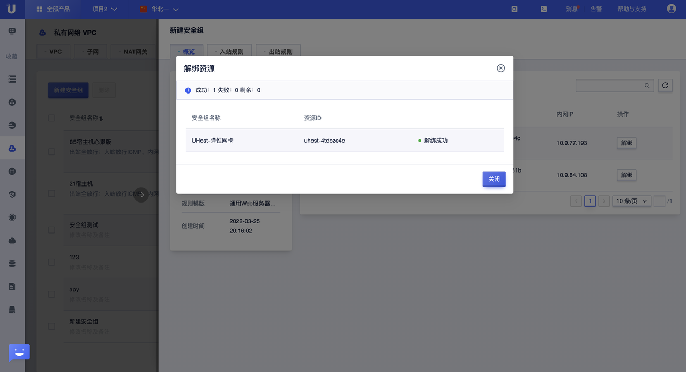

# 安全组操作手册

## 创建安全组

**创建安全组步骤**

Step1：选择【全部产品】--【网络】--【私有网络UVPC】--【安全组】，进入安全组管理界面，如下图所示：

Step2：点击【新建安全组】，在弹出对话框中输入“安全组名称”，选择“所属VPC”和“规则模板”；

Step3：填充完成相关信息，点击【确定】即可成功创建一个安全组；

## 参数描述

## 添加安全组规则

**添加规则步骤**

Step1：选中创建完成的安全组列表后面的【配置规则】按钮；或者点击创建的安全组列表后的【详情】按钮；

Step2：点击进入该界面的“入站规则”或者“出站规则”；

Step3：点击【添加规则】；

Step4：在弹出的界面中添加相应的规则，添加完成点击【确认】提交即可；出站规则配置操作参照入站规则配置即可；目标地址若选择安全组ID的话，当前仅支持选择自身安全组ID；

## 参数描述

表1：入方向规则参数说明

表2：出方向规则参数说明

## 安全组绑定实例

**安全组管理界面绑定实例**

Step1：点击【全部产品】--【网络】--【私有网络UVPC】--【安全组】，选择账号下对应的“项目名称”和“可用区”，进入安全组管理界面；

Step2：在安全组管理界面，点击待操作的安全组列表后面的【绑定资源】按钮；或者点击操作的安全组列表后面的【详情】按钮；

Step3：在弹出界面中，选择绑定的“资源类型”，同时勾选出待绑定的资源对象，确认提交即可；

Step4：绑定成功，对应的管理列表中即可生成对应的数据条目；

**主机管理界面绑定安全组** 

Step1：点击【全部产品】--【计算】--【云主机UHoust】--【主机管理】，进入云主机管理界面；

Step2：点击【创建云主机】，地域可用区只能为：华北一 可用区C，机型：快杰O型，CPU平台为：Intel（x86_64） IceLake及以上 或者 cascades及以上；

Step3：选择安全规则为：安全组，并添加相关安全组名称，该界面支持手工拖拽方式调整安全组组间优先级，参数配置完成，确认购买付费，即可完成安全规则为安全组的云主机创建；

**虚拟网卡管理界面绑定安全组**

Step1：点击【全部产品】--【网络】--【私有网络】--【虚拟网卡】，进入虚拟网卡管理界面；

Step2：点击【创建虚拟网卡】，在弹出界面中，安全组规则选择“安全组”，安全组选项下选择当前创建好的安全组；若该虚拟网卡下选中多个安全组，可通过拖拽调整各个安区组的执行顺序，安全组从上至下依次执行；

Step3：填写、输入完创建虚拟网卡的必要信息，点击【确定】即可；

## （可选）管理安全组

### 查看安全组

**场景一：查看某一地域下全部安全组信息；**

操作步骤：

点击【全部产品】--【网络】--【私有网络UVPC】--【安全组】，选择账号下对应的“项目名称”和“可用区”，即可看到该可用区下的全部安全组信息；

**场景二：查看某一地域下特定的安全组信息；**

操作步骤：

Step1：点击【全部产品】--【网络】--【私有网络UVPC】--【安全组】，选择账号下对应的“项目名称”和“可用区”，即可看到该可用区下的全部安全组信息；

Step2：在该页面右上角搜索框中，输入特定安全组的“安全组名称”，点击查询即可；

## 解绑安全组

**安全组侧解绑实例**

Step1：点击【全部产品】--【网络】--【私有网络UVPC】--【安全组】，选择账号下对应的“项目名称”和“可用区”，进入安全组管理界面；

Step2：点击安全组列表后的【详情】按钮，进入安全组“概览”界面；

Step3：点击已绑定资源列表后的【解绑】按钮，并点击【确定】该操作；

Step4：操作完成之后，即可完成解绑操作；

**主机侧解绑安全组**

Step1：点击【全部产品】--【计算】--【云主机UHoust】--【主机管理】，进入云主机管理界面；

Step2：点击相关云主机后的【更多操作】--【关联产品操作】--【配置安全规则】，进入云主机安全规则配置界面；

Step3：选择安全规则为安全组，将需要解绑的安全组取消勾选，点击【提交】即可；

Step4：可点击主机管理列表后的【详情】按钮，进入主机【安全规则】管理界面，查看当前云主机网卡下绑定的安全组信息；

#### **虚拟网卡侧解绑安全组**

Step1：点击【全部产品】--【网络】--【私有网络UVPC】--【虚拟网卡】，选择账号下对应的“项目名称”和“可用区”，进入虚拟网卡管理界面；

Step2：点击网卡列表后的【更多操作】--【配置规则】按钮，进入虚拟网卡安全规则配置界面；

Step3：选择安全规则为“安全组”，将需要解绑的安全组取消勾选，点击【提交】即可；

Step4：点击虚拟网卡管理列表后的【详情】按钮，进入虚拟网卡【安全规则】管理界面，在安全组卡片下查看当前网卡绑定的安全组信息；

## 删除安全组

Step1：在安全组管理界面中，点击安全组列表后的【更多操作】--【删除】按钮；

Step2：勾选删除安全组的同时自动进行资源解绑提示，点击【确定】即可；

Step3：在安全组管理界面筛选刚才删除的安全组名称，确认该安全组已被删除；

## 调整安全组优先级

### **主机管理界面调整安全组组间优先级**

Step1：点击【全部产品】--【计算】--【云主机UHoust】--【主机管理】，进入云主机管理界面；

Step2：点击相关云主机后的【更多操作】--【关联产品操作】--【配置安全规则】，进入云主机安全规则配置界面；

Step3：选择安全规则为安全组，可通过将已勾选的安全组进行拖拽操作调整安全组组间优先级，调整完成后点击【提交】即可；

Step4：可点击主机管理列表后的【详情】按钮，进入主机【安全规则】管理界面，查看当前云主机网卡下绑定的安全组信息及其优先级；

### **虚拟网卡管理界面调整安全组组间优先级**

Step1：点击【全部产品】--【网络】--【私有网络UVPC】--【虚拟网卡】，选择账号下对应的“项目名称”和“可用区”，进入虚拟网卡管理界面；

Step2：点击网卡列表后的【更多操作】--【配置规则】按钮，进入虚拟网卡安全规则配置界面；

Step3：选择安全规则为“安全组”，可通过将已勾选的安全组进行拖拽操作调整安全组组间优先级，调整完成后点击【提交】即可；

Step4：点击虚拟网卡管理列表后的【详情】按钮，进入虚拟网卡【安全规则】管理界面，在安全组卡片下查看当前网卡绑定的安全组信息；

## （可选）管理安全组规则

### 查看安全组规则

安全组创建成功后，用户可在控制台查看该安全组内对应的安全组规则；

#### 操作步骤

Step1：点击【全部产品】--【网络】--【私有网络UVPC】--【安全组】，选择账号下对应的“项目名称”和“可用区”，进入安全组管理界面；

Step2：点击列表中对应安全组后的【详情按钮】，在【入站规则】和【出站规则】界面查看对应的规则信息；

### 编辑安全组规则

Step1：在安全组管理界面，点击安全组条目后的【详情】按钮；

Step2：分别进入“入站规则”和“出站规则”界面；

Step3：在规则管理界面中点击【添加规则】，输入相关规则参数，点击【确认】，即可成功创建新的规则条目；（优先级取值唯一）

Step4：点击管理列表中，规则条目后的【编辑】按钮，即可进行规则参数变更操作，操作完成后点击【确认】即可生效；

Step5：出站规则的创建和编辑操作与入站规则操作一致，可参考入站规则操作步骤；

### 删除安全组规则

Step1：在“入站规则”管理界面，点击规则条目后的【删除】按钮，并确认操作；

Step2：操作成功后，管理界面会删除对应规则信息；

Step3：出站规则删除操作与入驻规则操作一致，可参考入站规则操作步骤；

### 安全组规则优先级调整

Step1：在入站规则管理界面中，点击待调整顺序的规则条目后的【编辑】按钮；

Step2：在弹出的对话框中，编辑该规则的优先级，新优先级必须与当前界面所有规则优先级不冲突，调整完成后点击【确认】即可；

Step3：调整完成后，可在当前界面查看规则新优先级信息；

Step4：出站规则优先级调整操作流程与入站规则一致，可参考入站规则优先级调整操作流程；

