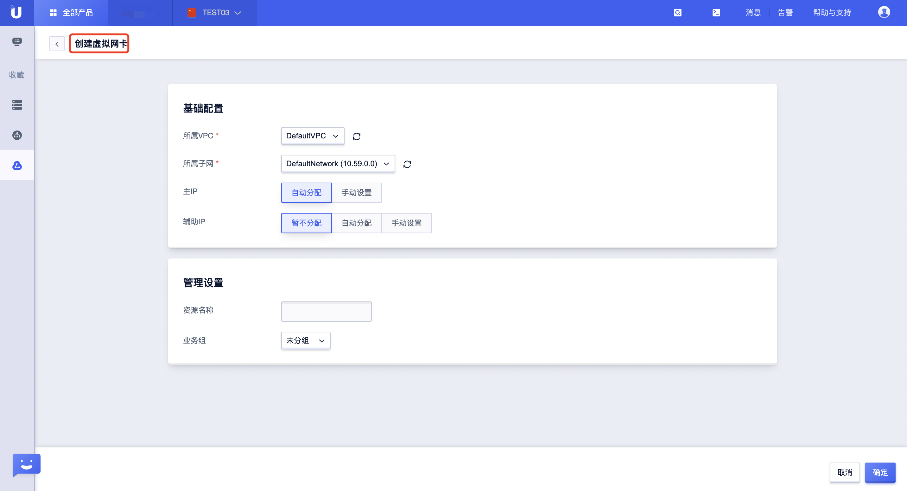

# 虚拟网卡

本文档仅介绍虚拟网卡页面的操作，在主机页面的操作详见

## 名词解释

* 默认网卡：主机开启网卡功能时由系统默认创建的网卡，原本绑定在云主机的EIP和防火墙都将落在默认网卡上。

* 自定义网卡：控制台手动创建的网卡，可与云主机弹性绑定。

* 辅助IP：控制台手动申请辅助IP，与主IP配合使用，可与云主机弹性绑定，可申请数量与云主机配置有关。

  

## 创建标题

登录控制台，【全部产品】中选择[虚拟网卡](https://console.ucloud.cn/vpc/vnic)，点击【创建虚拟网卡】




说明：

- 新建网卡自动绑定默认web防火墙。
- 自定义网卡独享配置，如资源名称备注、业务组、弹性IP、防火墙配置等，与主机无关，可与云主机弹性绑定。
- 云主机的网络配置自动落到默认网卡，默认网卡与云主机强绑定，与云主机的生命周期一致。

## 使用网卡

新创建的网卡是未绑定的外网弹性IP的，需要在创建完网卡后再行绑定。同时，可以在虚拟网卡列表页或详情页对网卡资源进行名称更改、绑定主机等操作。

> 自定义网卡绑定云主机后，需要在云主机上配置网卡信息和策略路由到系统（默认网卡无需配置）。

- 列表页操作
- 详情页操作
- 绑定网卡到云主机 

说明：

- 列表页点击点击【资源名称】或者在操作列点击【详情】即可进入资源的详情页面。
- 在控制台右上角，支持按需展示网卡信息列、下载网卡资源列表、刷新网卡资源列表信息、查阅文档等操作。

## 网卡配置指南

云主机默认网卡无需配置，但对应的辅助IP需要进行配置。

### CentOS7配置指南

现有主机的三张网卡配置如下，且两张自定义网卡已绑定到云主机。

```
eth0（默认网卡）
(主IP) 10.42.108.166
(辅助IP) 10.42.107.2
eth1（创建的自定义网卡）
(主IP) 10.42.71.137
(辅助IP) 10.42.71.3
eth2（创建的自定义网卡）
(主IP) 10.42.175.116
(辅助IP) 10.42.175.3
```

#### 第一步：关闭RPF

*临时关闭*

修改/proc/sys/net/ipv4/conf/all/rp_filter值：
```
echo 0 > /proc/sys/net/ipv4/conf/all/rp_filter
```
重启网络服务
```
service network restart
```

*永久关闭*

编辑/etc/sysctl.conf文件， 修改net.ipv4.conf.all.rp_filter值为0，然后重启服务器


#### 第二步：配置自定义网卡

*配置eth1*
```
# ifconfig eth1 10.42.71.137 netmask 255.255.0.0
# ifconfig eth1 mtu 1454
# echo "101 net_101 " >> /etc/iproute2/rt_tables
# ip route add default via 10.42.0.1 dev eth1 src 10.42.71.137 table net_101
# ip rule add from 10.42.71.137 table net_101
```

*配置eth2*
```
# ifconfig eth2 10.42.175.116 netmask 255.255.0.0
# ifconfig eth2 mtu 1454
# echo "102 net_102 " >> /etc/iproute2/rt_tables
# ip route add default via 10.42.0.1 dev eth2 src 10.42.175.116 table net_102
# ip rule add from 10.42.175.116 table net_102
```

*配置持久化*

eth1和eth2的网卡写配置文件
```
创建配置文件
# cp /etc/sysconfig/network-scripts/ifcfg-eth0 /etc/sysconfig/network-scripts/ifcfg-eth1
# cp /etc/sysconfig/network-scripts/ifcfg-eth0 /etc/sysconfig/network-scripts/ifcfg-eth2

修改文件中的
- DEVICE=虚拟网卡的网卡名
- HWADDR=虚拟网卡的MAC地址
- IPADDR=虚拟网卡的IP地址
```

策略路由写配置文件

```
# cat /etc/sysconfig/network-scripts/route-eth1

default via 10.42.0.1 dev eth1 src 10.42.71.137 table net_101

# cat /etc/sysconfig/network-scripts/rule-eth1

from 10.42.71.137 table net_101


# cat /etc/sysconfig/network-scripts/route-eth2

default via 10.42.0.1 dev eth2 src 10.42.175.116 table net_102

# cat /etc/sysconfig/network-scripts/rule-eth2

from 10.42.175.116 table net_102
```

#### 第三步：配置辅助IP

```
ip addr add 10.42.107.2 dev eth0
ip addr add 10.42.71.3 dev eth1
ip addr add 10.42.175.3 dev eth2
将IP地址替换成待绑定辅助IP地址，配置默认网卡辅助IP只需将网卡名称改成eth0，以此类推
```

添加的虚拟网卡主IP和辅助IP均可以ping通即配置完成

### CentOS 8配置指南

按照配额，购买一台2C2G的云主机，可以绑定2张虚拟网卡，每张虚拟网卡可以申请6个辅助IP。

现有主机的2张网卡配置如下，且一张自定义网卡已绑定到云主机。

```
eth0（默认网卡）
(主IP) 10.40.121.96
(辅助IP) 10.40.4.124
(辅助IP) 10.40.91.199
...
(辅助IP) 10.40.47.171
eth1（创建的自定义网卡）
(主IP) 10.40.54.131
(辅助IP) 10.40.33.188
(辅助IP) 10.40.134.89
...
(辅助IP) 10.40.44.173
```

#### 第一步：关闭RPF

*临时关闭*

修改/proc/sys/net/ipv4/conf/all/rp_filter值：

```
echo 0 > /proc/sys/net/ipv4/conf/all/rp_filter
```

重启网络服务

```
nmcli c reload
```

#### 第二步：配置自定义网卡eth1

eth1的网卡写配置文件，此处配置主IP即可

```
创建配置文件
# cp /etc/sysconfig/network-scripts/ifcfg-eth0 /etc/sysconfig/network-scripts/ifcfg-eth1

修改文件中的
- DEVICE=虚拟网卡的网卡名
- HWADDR=虚拟网卡的MAC地址
- IPADDR=虚拟网卡的主IP地址

示例：
DEVICE=eth1
HWADDR=52:54:00:1B:5E:57
IPADDR=10.40.54.131
```

策略路由写配置文件

```
# vim /etc/sysconfig/network-scripts/route-eth1

default via 10.40.0.1 dev eth1 src 10.40.54.131 table net_101

# vim /etc/sysconfig/network-scripts/rule-eth1

from 10.40.54.131 table net_101
```

重启网络服务

```
nmcli c reload
```

#### 第三步：配置辅助IP

```
ip addr add 10.40.33.188 dev eth1

将IP地址替换成待绑定辅助IP地址，配置默认网卡辅助IP只需将网卡名称改成eth0，以此类推
```

添加的虚拟网卡主IP和辅助IP均可以ping通即配置完成

### Windows配置指南

标准镜像默认开通DHCP，无需多余配置。

若DHCP已关闭，手动配置方式如下：

1、进入到Windows系统的“网络和共享中心”，如果是已开启了DHCP的系统，可以看到绑定的网卡。


2、点击网络，依次点击“属性”- 双击“Internet Protocol Version 4（TCP/IPv4）”- 选择 “使用下面的IP地址”，按照实际配置填写IP和DNS信息。


3、验证：使用同VPC下机器ping绑定的自定义网卡内网IP地址，可以ping通说明配置完成。


## 常见问题FAQ

### 1、为什么配置的多网卡不通？

一般情况下是由于网卡的配置的原因，可按如下方式检查：

1、检查网卡是否已绑定云主机，且在云主机上配置了网卡

2、检查RPF是否已关闭

3、网卡路由是否正确

若检查过以上配置仍旧以上不通，可提供：

- 源IP到目的IP的五元组及每一跳信息
- 网卡与主机的绑定关系
- 资源所属子网信息
- 网卡的路由配置


交由[售后咨询](https://spt.ucloud.cn/)辅助查看。

### 2、云主机未开启网卡功能，想要开启第二张网卡，如何处理？

若云主机在创建时未开启网卡功能，后续无法开启，建议新建主机以使用网卡功能。
